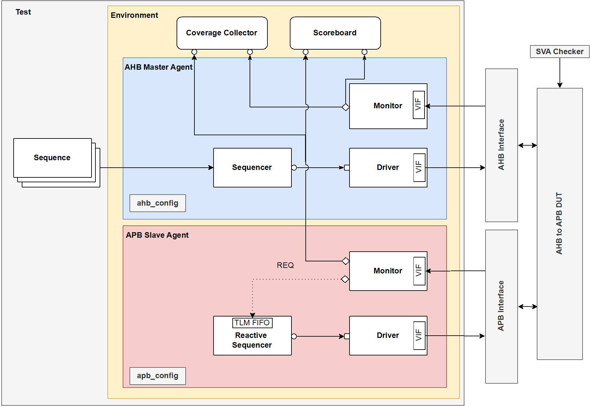

# AHB-to-APB-Bridge-UVM
UVM-based verification of an AHB-to-APB Bridge, including verification plan, functional coverage, testbench implementation, and verification results.

## Testbench Architecture
